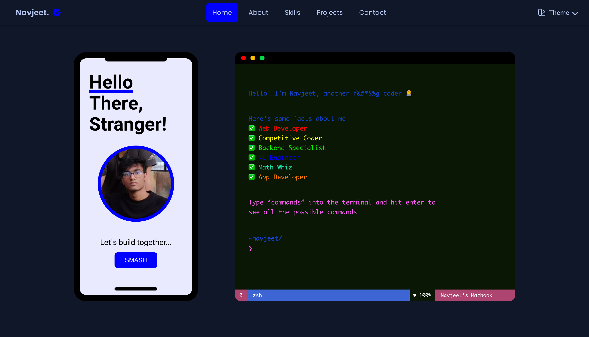
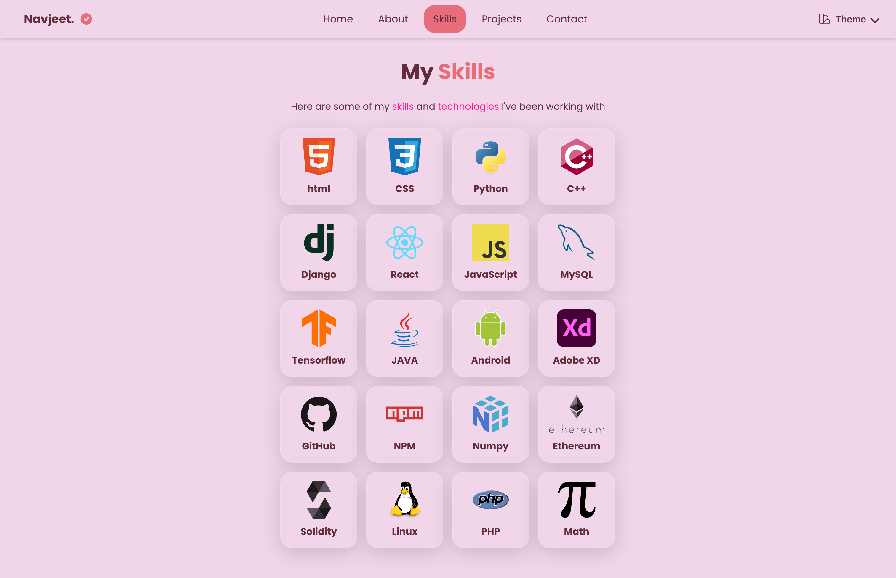

# Personal Portfolio 👨‍💻
This is my developer portfolio built using ReactJS.

View it live [here](http://navjeet.tech)

<table>
  <tr>
    <td></td>
    <td></td>
  </tr>
 </table>

1. There is a basic console that looks like a terminal and functions on a handful number of commands. 
2. There are two themes of the site between which you can toggle by pressing the theme button on top right.
3. 

